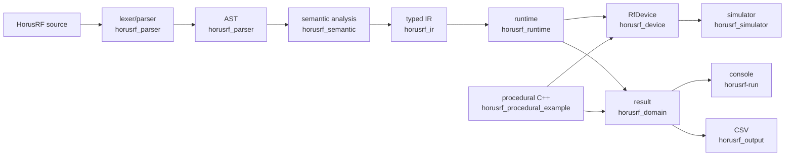
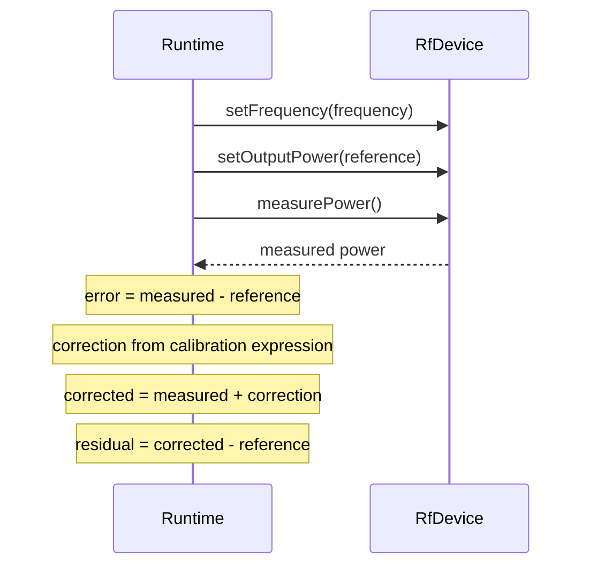

# HorusRF architecture

## Context and physical model

HorusRF is a focused demonstration of what a declarative DSL for RF
characterization could look like. Its reference experiment characterizes an
imperfect tester transmit path: the runtime sets a nominal output power and a
frequency through `RfDevice`, then observes power from external measurement
equipment represented by the deterministic simulator. That equipment is part of
the physical setup; it is not a separately programmable DSL instrument. The
measured-minus-reference error produces an equal and opposite correction.

The public result owns its samples, calibration dimensions and corrections. It does
not alias source text, compiler storage, a device, or simulator state.

## Compile and execution flow

`horusrf-run` composes the parser, semantic analyzer, lowerer, runtime, simulator,
and output layer. The procedural example independently orchestrates the experiment
and joins the declarative path only at domain quantities, `RfDevice`, the simulator,
and result/metric types. It does not use compiler or runtime orchestration.

## Representation and ownership boundaries

- The AST preserves written statement/expression structure and source spans. It has
  no semantic, device, or runtime dependency.
- Semantic analysis resolves declarations, references, dimensions, expression
  types, calibration indexes, and canonical units.
- IR is a typed, device-independent plan of values and operations. Runtime consumes
  it without depending on AST shape.
- Runtime executes IR only through the caller-owned `RfDevice&`. The device must
  remain alive for the call; returned results do not refer to it.
- `Frequency`, `Power`, `PowerDelta`, samples, artifacts, and metrics are shared
  domain values. CSV is a terminal presentation layer and does not feed execution.

## Runtime sequence and failure behavior

For each planned frequency, device calls and computation occur in this order:

The sweep is generated by integer index from its canonical-Hz start and step. An
endpoint on the step lattice is included with a small floating-point tolerance; a
non-divisible range stops at the last point below the endpoint. A sweep permits at
most 1,000,000 points. Exactly one measurement occurs per point, and sample,
calibration dimension, and correction vectors remain aligned. Metrics are calculated
only after all points succeed.

IR and sweep validation happen before device calls. Device exceptions propagate:
there is no retry and no partial `CharacterizationResult` is returned.

## Dependencies, determinism, and extension points

The target-level dependency rules are:

| Target | Allowed direct project dependencies |
|---|---|
| `horusrf_parser` | AST/parser headers only |
| `horusrf_domain` | none |
| `horusrf_semantic` | domain, parser/AST |
| `horusrf_ir` | domain; semantic only while lowering |
| `horusrf_device` | domain |
| `horusrf_runtime` | IR, device, domain |
| `horusrf_simulator` | device, domain |
| `horusrf_procedural_example` | device, domain |
| `horusrf_output` | domain |
| `horusrf-run` | composition of the implemented layers |

Domain code must not depend on compiler layers. AST must not depend on semantic,
runtime, or device code. Runtime must not access simulator internals, and procedural
orchestration must not depend on the compiler or runtime. Strong dBm/dB types make
cross-layer dimensional intent explicit.

Fresh simulator instances with the same calls produce identical observations. The
simulator model remains private. Console and CSV output use the classic locale and
round-trip-capable numeric precision, so results do not vary with host locale.

### Deliberately limited scope

The architecture leaves boundaries at which a larger system could add real hardware
implementations of `RfDevice`, richer calibration artifacts, explicit application
syntax, or alternative compiler backends. They illustrate how the design separates
concerns; they are not a roadmap. The demonstration has no hardware backend,
persisted calibration, general instrument model, optimizer, bytecode, or LLVM
integration.
