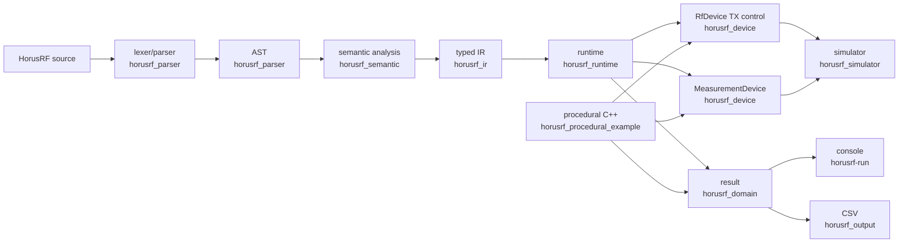
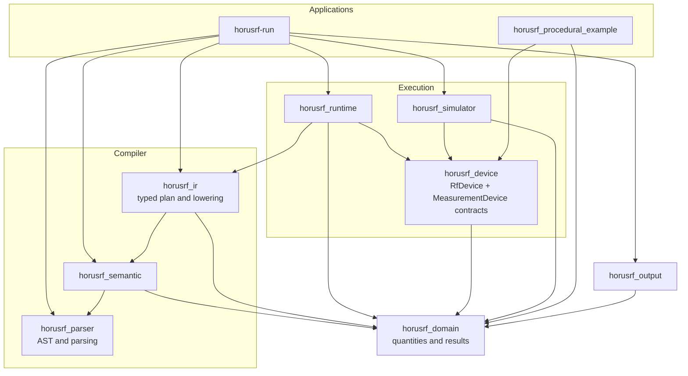
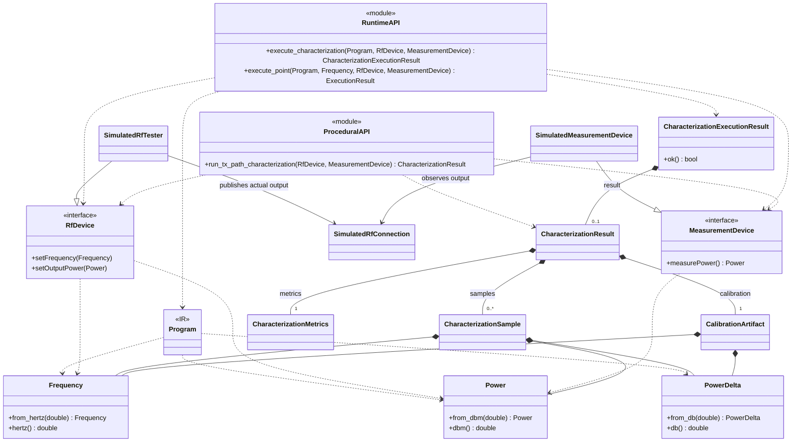
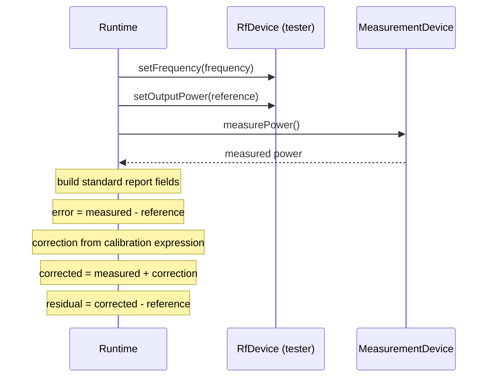

# HorusRF architecture

## Context and physical model

HorusRF is a focused demonstration of what a declarative DSL for RF
characterization could look like. Its reference experiment characterizes an
imperfect tester transmit path: the runtime sets a nominal output power and a
frequency through the TX-only `RfDevice` contract, then obtains power through a
separate `MeasurementDevice` contract. The deterministic simulator implements
these as a simulated RF tester and calibrated measurement instrument connected by
an opaque RF-output object. The measurement equipment is part of the physical
setup; it is not a separately programmable DSL instrument. The
measured-minus-reference error produces an equal and opposite correction.

The public result owns its samples, calibration dimensions and corrections. It does
not alias source text, compiler storage, a device, or simulator state.
`CharacterizationSample` is also the standard verification report for one point:
domain code consistently calculates raw error, corrected power, and residual error
from the reference, measurement, and calibration correction for both declarative
and procedural execution.

## Compile and execution flow

`horusrf-run` composes the parser, semantic analyzer, lowerer, runtime, simulator,
and output layer. The procedural example independently orchestrates the experiment
and joins the declarative path only at domain quantities, the `RfDevice` and
`MeasurementDevice` contracts, the simulator, and result/metric types. It does not
use compiler or runtime orchestration.

## Component dependencies

The execution flow above shows how data moves through the system. The following
view instead shows allowed compile-time dependency direction. An arrow points from
a component to a component it may depend on; it does not imply ownership or call
order.

The CLI is the composition root, so its broad dependencies do not relax the
dependencies of the components it assembles. In particular, runtime reaches
simulated or future hardware implementations only through `RfDevice` and
`MeasurementDevice`. `RfDevice` is intentionally the tester TX-control boundary;
it has no measurement operation.

## Public contracts and ownership

This high-level class view intentionally omits AST nodes, semantic expressions,
individual IR operations, diagnostics, and private simulator state. It shows the
stable contracts that cross architectural boundaries. Filled diamonds denote
owned result data; dashed arrows denote use through parameters or return values.

## Representation and ownership boundaries

- The AST preserves written statement/expression structure and source spans. It has
  no semantic, device, or runtime dependency.
- Semantic analysis resolves declarations, references, dimensions, expression
  types, calibration indexes, and canonical units.
- IR is a typed, device-independent plan of values and operations. Runtime consumes
  it without depending on AST shape.
- Runtime executes IR only through caller-owned `RfDevice&` and
  `MeasurementDevice&` abstractions. Both must remain alive for the call; returned
  results do not refer to either one.
- `Frequency`, `Power`, `PowerDelta`, samples, artifacts, and metrics are shared
  domain values. CSV is a terminal presentation layer and does not feed execution.

## Runtime sequence and failure behavior

For each planned frequency, equipment calls and computation occur in this order:

The sweep is generated by integer index from its canonical-Hz start and step. An
endpoint on the step lattice is included with a small floating-point tolerance; a
non-divisible range stops at the last point below the endpoint. A sweep permits at
most 1,000,000 points. Exactly one measurement occurs per point, and sample,
calibration dimension, and correction vectors remain aligned. Metrics are calculated
only after all points succeed.

IR and sweep validation happen before equipment calls. Equipment exceptions propagate:
there is no retry and no partial `CharacterizationResult` is returned.

## Dependencies, determinism, and extension points

The target-level dependency rules are:

| Target | Allowed direct project dependencies |
|---|---|
| `horusrf_parser` | AST/parser headers only |
| `horusrf_domain` | none |
| `horusrf_semantic` | domain, parser/AST |
| `horusrf_ir` | domain; semantic only while lowering |
| `horusrf_device` | domain |
| `horusrf_runtime` | IR, device, domain |
| `horusrf_simulator` | device, domain |
| `horusrf_procedural_example` | device, domain |
| `horusrf_output` | domain |
| `horusrf-run` | composition of the implemented layers |

Domain code must not depend on compiler layers. AST must not depend on semantic,
runtime, or device code. Runtime must not access simulator internals, and procedural
orchestration must not depend on the compiler or runtime. The simulator's
deterministic TX-path response is a private implementation function: the tester
publishes only resulting power to the opaque connection, and measurement exposes
only `measurePower()`. Strong dBm/dB types make cross-layer dimensional intent
explicit.

Fresh simulator instances with the same calls produce identical observations. The
simulator model remains private. Console and CSV output use the classic locale and
round-trip-capable numeric precision, so results do not vary with host locale.

### Deliberately limited scope

The architecture leaves boundaries at which a larger system could add real hardware
implementations of `RfDevice` and `MeasurementDevice`, richer calibration artifacts,
explicit application syntax, or alternative compiler backends. They illustrate how
the design separates concerns; they are not a roadmap. The demonstration has no
hardware backend, persisted calibration, general instrument model, optimizer,
bytecode, or LLVM integration.
