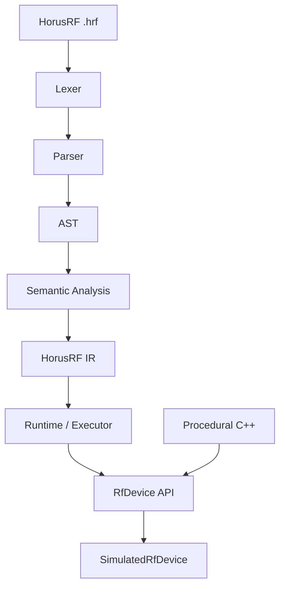

# HorusRF M0 Roadmap

## Repository status

Slice 1 is complete. The repository now contains the CMake/C++20 build, CTest
integration, grammar, syntax AST, handwritten lexer and parser, canonical
TX-path fixture, and dependency-free parser tests. Its accepted specification
is retained in [`docs/archive/slice-1-spec.md`](archive/slice-1-spec.md).

Slice 2 is complete. Its implementation and acceptance plan is
retained in
[`docs/archive/slice-2-plan.md`](archive/slice-2-plan.md).

Slice 3 is complete. Its implementation and acceptance plan is retained in
[`docs/archive/slice-3-plan.md`](archive/slice-3-plan.md).

Slice 4 is complete. Its implementation and acceptance record is in
[`docs/slice-4-plan.md`](slice-4-plan.md).

## Proposed repository tree

```text
.
├── AGENTS.md
├── CMakeLists.txt
├── README.md
├── LICENSE
├── cmake/
│   └── warnings.cmake
├── docs/
│   ├── architecture.md
│   ├── language.md
│   └── m0-roadmap.md
├── grammar/
│   └── horusrf.ebnf
├── include/horusrf/
│   ├── ast/
│   │   └── ast.hpp
│   ├── domain/
│   │   ├── quantity.hpp
│   │   ├── results.hpp
│   │   └── units.hpp
│   ├── device/
│   │   ├── rf_device.hpp
│   │   └── simulated_rf_device.hpp
│   ├── ir/
│   │   └── ir.hpp
│   ├── parser/
│   │   ├── lexer.hpp
│   │   ├── parser.hpp
│   │   └── token.hpp
│   ├── runtime/
│   │   ├── executor.hpp
│   │   └── csv_writer.hpp
│   └── semantic/
│       ├── analyzer.hpp
│       └── diagnostics.hpp
├── src/
│   ├── ast/
│   ├── domain/
│   ├── device/
│   ├── ir/
│   ├── parser/
│   ├── runtime/
│   └── semantic/
├── simulator/
│   └── simulated_rf_device.cpp
├── examples/
│   ├── tx_path_characterization.hrf
│   └── cpp/
│       └── tx_path_characterization.cpp
├── tools/
│   └── horusrf_run.cpp
└── tests/
    ├── test_support.hpp
    ├── parser/
    ├── domain/
    ├── semantic/
    ├── ir/
    ├── runtime/
    ├── simulator/
    └── integration/
```

## Major C++ types and interfaces

Source locations:

```cpp
struct SourcePosition {
    std::size_t line;
    std::size_t column;
    std::size_t offset;
};

struct SourceSpan {
    SourcePosition begin;
    SourcePosition end;
};
```

Domain quantities:

```cpp
enum class Dimension {
    Frequency,
    AbsolutePower,
    RelativePower,
};

class Frequency;
class Power;
class PowerDelta;
```

Device API:

```cpp
class RfDevice {
public:
    virtual ~RfDevice() = default;

    virtual void setFrequency(Frequency frequency) = 0;
    virtual void setOutputPower(Power power) = 0;
    virtual Power measurePower() = 0;
};
```

For M0, this deliberately small interface represents the complete physical setup: an
RF tester generates a signal through its TX path, and calibrated external equipment
measures the actual output. `measurePower()` returns that external observation. The
measurement equipment is part of the simulated setup rather than a separately
programmable DSL device, so M0 does not need an instrument hierarchy.

Results:

```cpp
struct CharacterizationSample {
    Frequency frequency;
    Power referencePower;
    Power measuredPower;
    PowerDelta error;
    PowerDelta correction;
    Power correctedPower;
    PowerDelta residualError;
};

struct CharacterizationResult {
    std::vector<CharacterizationSample> samples;
    CalibrationArtifact txPowerCalibration;
    double uncorrectedRmsErrorDb;
    double correctedRmsErrorDb;
    double maximumAbsoluteErrorDb;
    double correctedMaximumAbsoluteErrorDb;
};
```

The calibration artifact is conceptually:

```cpp
struct CalibrationArtifact {
    std::string name;
    std::vector<Frequency> dimensions;
    std::vector<PowerDelta> corrections;
};
```

For M0, `dimensions` contains the sweep frequencies and `corrections` contains one `PowerDelta` per point. A future artifact model may generalize this to multidimensional tables.

## Exact M0 language surface

M0 supports one `characterize` block, one reference power, one frequency sweep, one power measurement, named derived quantities, and named calibration artifacts indexed by an explicit `over` clause. Arithmetic expressions may use identifiers, quantities, unary minus, addition, subtraction, and `reference.power`.

Canonical program:

```hrf
characterize tx_path {

    reference power = -10 dBm

    sweep frequency
        2.40 GHz .. 2.50 GHz
        step 1 MHz

    measure power

    derive error =
        power - reference.power

    derive calibration tx_power {
        correction = reference.power - power
        over frequency
    }
}
```

The example is the canonical M0 language example and test fixture. It intentionally distinguishes:

- `measure`: acquires information from a device;
- `derive`: computes a value without hardware side effects;
- `derive calibration`: produces a named reusable artifact;
- `over`: identifies the independent dimensions indexing that artifact.

M0 does not include conditionals, loops, user-defined functions, arrays, interpolation, phase, gain, temperature, DSL declarations for external instruments, calibration application syntax, or procedural statements. Calibration application is documented as a future extension; M0 derives and exports the calibration artifact.

## M0 physical experiment

M0 characterizes the RF tester's TX path. The tester generates its own RF signal;
there is no external RF signal generator. Calibrated external measurement equipment
observes the tester's actual TX output:

```text
RF tester: nominal output configuration
        -> imperfect TX RF path
        -> calibrated external measurement equipment
        -> measured power
        -> comparison with reference
        -> frequency-dependent calibration
```

In this experiment, `reference power` is the nominal output power that the tester is
intended to produce and against which the externally measured output is compared. It
remains a general `reference` language concept because future characterization
scenarios may interpret references differently.

At each sweep point the physical model is:

```text
P_measured(f) = P_reference + TX_error(f)
error(f)      = P_measured(f) - P_reference
C(f)          = P_reference - P_measured(f) = -error(f)
```

For example, a reference of `-10.0 dBm` and a measurement of `-9.6 dBm`
produce an error of `+0.4 dB` and a correction of `-0.4 dB`. Applying the
calibration is verification behavior in M0:

```text
P_corrected(f) = P_uncorrected(f) + C(f)
```

The quantity rules therefore remain `dBm - dBm -> dB` and
`dBm + dB -> dBm`; the scenario change does not introduce special-case TX
dimensions.

## Initial formal grammar

`grammar/horusrf.ebnf` is the authoritative syntax contract.

```ebnf
program             = characterization ;

characterization   = "characterize" , identifier , "{" ,
                     statement* ,
                     "}" ;

statement          = reference_statement
                   | sweep_statement
                   | measurement_statement
                   | derive_statement
                   | calibration_statement ;

reference_statement =
                     "reference" , "power" , "=" , signed_quantity ;

sweep_statement    = "sweep" , "frequency" ,
                     frequency_range ,
                     "step" , quantity ;

frequency_range    = quantity , ".." , quantity ;

measurement_statement =
                     "measure" , "power" ;

derive_statement   = "derive" , identifier , "=" , expression ;

calibration_statement =
                     "derive" , "calibration" , identifier , "{" ,
                     "correction" , "=" , expression ,
                     "over" , identifier , { "," , identifier } ,
                     "}" ;

expression         = additive_expression ;

additive_expression =
                     unary_expression ,
                     { ("+" | "-") , unary_expression } ;

unary_expression   = [ "-" ] , primary_expression ;

primary_expression = quantity
                   | reference
                   | identifier
                   | "(" , expression , ")" ;

reference          = "reference" , "." , identifier ;

signed_quantity    = [ "-" ] , number , unit ;
quantity           = number , unit ;

number             = digit , { digit } ,
                     [ "." , digit , { digit } ] ;

unit               = "Hz" | "kHz" | "MHz" | "GHz" | "dBm" | "dB" ;

identifier         = letter , { letter | digit | "_" } ;
letter             = "A"…"Z" | "a"…"z" ;
digit              = "0"…"9" ;
```

Whitespace and comments are lexer concerns. Dimensional validity is semantic-analysis behavior, not grammar behavior.

## AST model

The AST represents what the programmer wrote, not executable operations.

```cpp
struct Program {
    Characterization characterization;
};

struct Characterization {
    std::string name;
    std::vector<Statement> statements;
    SourceSpan span;
};
```

Statements include `ReferenceStatement`, `SweepStatement`, `MeasurementStatement`, `DeriveStatement`, and `CalibrationStatement`.

Expressions include `QuantityLiteral`, `IdentifierExpression`, `ReferenceExpression`, `UnaryExpression`, and `BinaryExpression`.

AST types must not depend on devices, runtime execution, or simulator implementations.

## Semantic and dimension model

Semantic types are:

```cpp
enum class SemanticType {
    Frequency,
    Power,
    PowerDelta,
};
```

The semantic model also distinguishes the kind of object created by each construct:

| Construct | Semantic object |
|---|---|
| `sweep frequency ...` | `Sweep<Frequency>` |
| `measure power` | `Measurement<Power>` associated with the active sweep |
| `derive error = ...` | `DerivedQuantity<PowerDelta>` |
| `derive calibration tx_power ... over frequency` | `Calibration<Frequency, PowerDelta>` |

This semantic model is defined before execution or syntax expansion. New syntax must identify the object it creates or modifies.

The semantic distinction is intentional:

- `reference` declares a comparison baseline; in this experiment it is the nominal
  tester output power;
- `sweep` creates an independent variable and its domain;
- `measure` requests a physical acquisition;
- `derive` computes a value without hardware side effects;
- `derive calibration` creates a reusable named artifact;
- `over` declares the artifact's indexing dimensions.

The calibration declaration does not modify the device or mutate subsequent measurements. It derives a function/table equivalent to:

```text
tx_power : Frequency -> PowerDelta
```

The M0 runtime may apply that artifact during result verification so it can calculate corrected measurements and residuals, but application syntax is deliberately deferred to a later milestone.

Canonical units:

| Source unit | Semantic type | Canonical value |
|---|---|---|
| `Hz`, `kHz`, `MHz`, `GHz` | Frequency | Hz |
| `dBm` | Power | dBm |
| `dB` | PowerDelta | dB |

Semantic analysis validates units, identifiers, references, sweep dimensions, available measurements, expressions, calibration dimensions, calibration correction types, and duplicate declarations. It must reject a calibration whose `over` variables are not active sweep variables.

Example diagnostic:

```text
semantic.dimension_mismatch:
cannot add frequency [GHz] and power [dBm]
```

## Explicit dBm/dB rules

Supported operations:

| Operation | Result |
|---|---|
| `Power - Power` | `PowerDelta` |
| `Power + PowerDelta` | `Power` |
| `PowerDelta + PowerDelta` | `PowerDelta` |
| unary `-PowerDelta` | `PowerDelta` |

Rejected in M0:

| Operation | Reason |
|---|---|
| unary `-Power` | not needed by the experiment |
| `Power + Power` | invalid logarithmic quantity operation |
| `PowerDelta - Power` | incompatible dimensions |
| `Power - PowerDelta` | not part of M0 semantics |

Required expressions type-check as:

```text
power - reference.power  -> dB
-error                    -> dB
measured + correction     -> dBm
```

## Minimal HorusRF IR

The IR is a small typed execution plan rather than a general compiler IR.

```cpp
struct ExperimentIr {
    Power referencePower;
    FrequencySweep sweep;
    std::string measuredQuantity;
    DerivedErrorPlan errorPlan;
    CalibrationPlan calibrationPlan;
};
```

Conceptual operations are `ConfigureReference`, `Sweep`, `MeasurePower`, `ComputeDerivedQuantity`, `BuildCalibration`, `ApplyCalibrationForVerification`, and `RecordSample`.

The calibration plan explicitly contains:

```text
artifact name: tx_power
index dimensions: frequency
correction expression: reference.power - power
```

At runtime this produces a calibration artifact equivalent to:

```text
tx_power : Frequency -> PowerDelta
```

The runtime's verification-only application is mathematically:

```text
corrected_power(f) = measured_power(f) + tx_power.correction(f)
```

The IR earns its existence by separating validated semantic meaning from syntax and by giving the runtime a device-independent execution plan. It prevents the runtime from depending directly on AST shape and creates a future boundary between device operations and computational operations.

M0 will not include SSA, registers, control-flow graphs, optimization passes, bytecode infrastructure, or LLVM.

## Runtime architecture

The runtime receives validated IR and an `RfDevice`. For each generated frequency it:

1. calls `setFrequency`;
2. calls `setOutputPower` with the reference power;
3. calls `measurePower` to obtain the calibrated external measurement;
4. calculates measured minus reference;
5. derives the error and calibration correction;
6. records the raw and derived sample data;
7. builds the named calibration artifact;
8. calculates aggregate metrics and verifies the correction against the known reference.

Conceptual API:

```cpp
CharacterizationResult execute(
    const ExperimentIr& ir,
    RfDevice& device);
```

The runtime never accesses simulator internals.

## Deterministic simulator model

The simulator will use a fixed private model such as:

```text
TX_error(f) = 0.35 dB + 0.20 dB * sin(2π * normalized_frequency)
```

where 2.40 GHz maps to zero and 2.50 GHz maps to one.

```text
measured_power(f) = configured_output_power + hidden_TX_error(f)
```

The simulator models the imperfect TX path, will have no random noise in M0,
and will require both frequency and output power configuration before measurement.
Its frequency-dependent TX error remains private: HorusRF discovers it only through
the externally observed measurements. Identical fresh simulator instances produce
identical results.

## Procedural C++ architecture

`examples/cpp/tx_path_characterization.cpp` will independently orchestrate the same experiment using:

- `Frequency`, `Power`, and `PowerDelta`;
- `RfDevice`;
- `SimulatedRfDevice`;
- shared low-level result and metric types where appropriate.

It will not include or call the lexer, parser, AST, semantic analyzer, IR, or HorusRF runtime. It must not call a shared complete-characterization function, because the comparison must retain independent orchestration.

Its orchestration is conceptually:

```cpp
for (auto frequency = start; frequency <= stop; frequency += step) {
    device.setFrequency(frequency);
    device.setOutputPower(referencePower);
    const auto measured = device.measurePower();
    const auto error = measured - referencePower;
    const auto correction = referencePower - measured;
    results.add(frequency, referencePower, measured, error, correction);
}
```

This illustrates physical intent rather than prescribing an additional interface.
The procedural path may share low-level quantities, the device and simulator, result
value types, and metric helpers, but not the sweep/characterization orchestration.

## Integration tests

### HorusRF end-to-end

The test will load the actual `examples/tx_path_characterization.hrf`, then run lexer, parser, semantic analysis, IR lowering, runtime, device API, simulator, derivation, calibration-artifact construction, and verification. It will not manually construct AST or IR and will not access hidden simulator state.

Assertions include 101 samples, the expected frequency range and spacing, the
`-10 dBm` reference at every point, measured values containing the deterministic TX
path error, `error = measured - reference`,
`correction = reference - measured`, corrected power and residual error, and
materially lower corrected RMS and maximum absolute errors.

It will also assert that the semantic model and IR contain a named `tx_power` calibration indexed over `frequency`, with one correction value per sweep point.

### Procedural/HorusRF equivalence

Two fresh deterministic simulators will be used:

```text
simulator A -> procedural C++ experiment
simulator B -> HorusRF pipeline
```

The test compares frequencies, reference powers, measurements, errors, corrections,
corrected values, residuals, RMS metrics, and maximum-error metrics within documented
floating-point tolerance. Each path receives a fresh equivalent simulator instance;
the HorusRF path must start by reading the real canonical `.hrf` fixture.

## Metrics

Required:

- uncorrected RMS error;
- corrected RMS error.

Also calculate:

- maximum absolute uncorrected error;
- maximum absolute corrected error;
- improvement ratio.

The deterministic model permits near-exact pointwise correction. The integration test may require:

```text
corrected_rms_error < 0.1 * uncorrected_rms_error
```

with a small absolute numerical tolerance.

## CSV strategy

The executable will support:

```text
horusrf-run examples/tx_path_characterization.hrf
horusrf-run examples/tx_path_characterization.hrf --csv output.csv
```

CSV columns:

```text
frequency_hz,
reference_power_dbm,
measured_power_dbm,
error_db,
correction_db,
corrected_power_dbm,
residual_error_db
```

CSV and console metrics will be generated from the same `CharacterizationResult`.

## Vertical implementation slices

### Slice 1 — Build and parsing (complete)

Implement CMake, targets, grammar, tokens, lexer, parser, AST, canonical example program, and parser tests.

Archived specification and acceptance record:
[`docs/archive/slice-1-spec.md`](archive/slice-1-spec.md).

Acceptance: the complete canonical example parses, including `derive calibration ... over frequency`; AST structure is verified for the calibration body and indexing clause; malformed syntax yields source locations; and no runtime/device code is involved.

### Slice 2 — Domain semantics (complete)

Implement units, conversions, `Power`, `PowerDelta`, explicit arithmetic, semantic analysis, calibration artifact typing, and diagnostics.

Archived implementation and acceptance record:
[`docs/archive/slice-2-plan.md`](archive/slice-2-plan.md).

Acceptance: supported units normalize correctly; valid dBm/dB expressions pass; calibration corrections have `PowerDelta` type; `over frequency` resolves to the active frequency sweep; and invalid dimensions, references, and calibration indexes fail with structured diagnostics.

### Slice 3 — IR lowering (complete)

Implement typed IR and AST-to-IR lowering.

Archived implementation and acceptance record:
[`docs/archive/slice-3-plan.md`](archive/slice-3-plan.md).

Acceptance: the validated example lowers to an IR containing reference, sweep, measurement, derived error, named calibration, and `over frequency` meaning without concrete device dependencies.

### Slice 4 — Device execution (complete)

Implement `RfDevice`, `SimulatedRfDevice`, device-bound single-point IR
execution, and runtime tests.

Implementation and acceptance record: [`docs/slice-4-plan.md`](slice-4-plan.md).

Acceptance: valid IR executes at one supplied frequency through the device
interface; simulator behavior is deterministic and hidden error state remains
private. Sweep generation and result aggregation remain Slice 5 work.

### Slice 5 — Complete characterization

Implement sweep execution, error calculation, calibration-artifact generation, correction application within verification, corrected measurements, residuals, and metrics.

Acceptance: the actual `.hrf` program completes the experiment, produces `tx_power : Frequency -> PowerDelta`, and materially reduces RMS error when that artifact is applied to the measured samples.

### Slice 6 — Procedural reference

Implement the independent procedural C++ example.

Acceptance: the procedural path uses domain/device infrastructure only and produces equivalent results.

### Slice 7 — End-to-end proof and CSV

Implement integration tests, CLI, and CSV output.

Acceptance: documented commands execute the actual example, produce real CSV values, and pass both integration tests.

### Slice 8 — Documentation and hardening

Complete README, architecture documentation, language documentation, AGENTS.md, diagrams, diagnostics cleanup, and test organization.

Acceptance: clean-build commands work, documentation matches behavior, and the full deterministic test suite passes.

## Architecture diagram



## Documentation outline

`docs/architecture.md` will document the DSL/compiler/runtime separation, AST versus IR, semantic validation, device boundaries, procedural comparison, simulator encapsulation, and future LLM/LLVM directions without implementing them.

`docs/language.md` will document the implemented grammar, quantities, dimensions, dBm/dB arithmetic, references, sweeps, measurements, derived quantities, calibration artifacts, `over` indexing, diagnostics, current limitations, and clearly marked future features such as calibration application.

`AGENTS.md` will encode the project constraints around grammar synchronization, semantic analysis, physical types, AST/IR boundaries, runtime/device separation, simulator secrecy, deterministic tests, and avoiding speculative infrastructure.

## Project assumptions

Implementation assumptions:

- C++20;
- CMake and CTest;
- dependency-free handwritten lexer/parser;
- `double` internal storage behind strong domain types;
- deterministic simulator with no noise in M0;
- one characterization block and one frequency sweep;
- no third-party testing framework unless later required.
